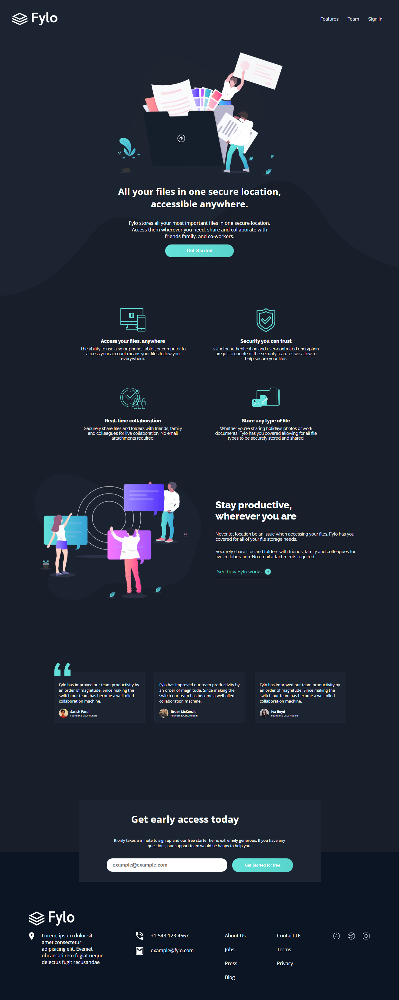

# Frontend Mentor - Fylo dark theme landing page solution

## Welcome! 👋

Thanks for checking out this project!

This is a solution for a Frontend Mentor challenge that consists on building a landing page that looks as close to the given design as possible. The goal is to improve my web layout skills by building a realistic project.

## Table of contents

- [Overview](#overview)
  - [The challenge](#the-challenge)
  - [Screenshot](#screenshot)
  - [Links](#links)
- [My process](#my-process)
  - [Built with](#built-with)
  - [Continued development](#continued-development)
  - [Useful resources](#useful-resources)
- [Author](#author)

## Overview

### The challenge

Users should be able to:

- View the optimal layout for the site depending on their device's screen size
- See hover states for all interactive elements on the page

### Screenshot

### Links

- Solution URL: 
- challenge URL: 

## My process

### Built with

- Semantic HTML5 markup
- CSS custom properties
- Flexbox
- CSS Grid

### Continued development

in future projects I want to focus in more complex projects not only landing page projects
### Useful resources

- [css breakpoints](https://getbootstrap.com/docs/5.0/layout/breakpoints/) - are points where the website content responds according to the device width, allowing you to show the best possible layout to the user.

## Author
- Twitter - [@joseph2s5](https://www.twitter.com/joseph2s5)

